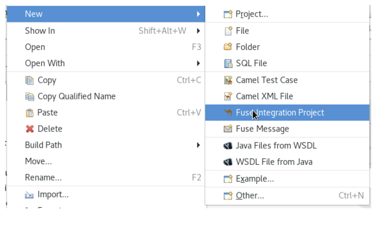
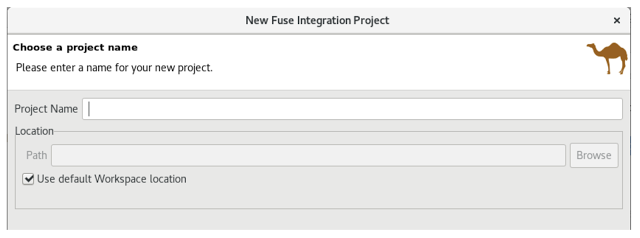
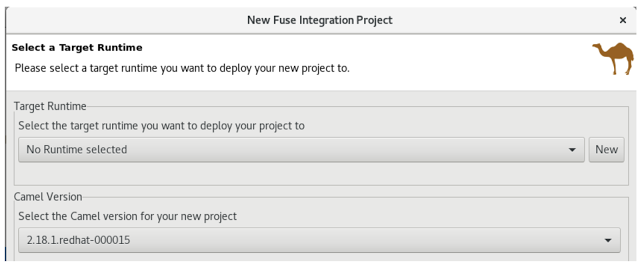

## API All in one

This tech quickie is going to guide you through how to implement an API from scratch. 


### Create a New Fuse Project on OpenShift

Start with built-in SpringBoot on OpenShift template. Right click in the Project Explorer pane and select New > Fuse Integration Project.



On the Choose a Project name page, enter a project name in the Project Name field. Click Next to continue and accept the defaults for all the other fields.  



On the Select a Target Runtime page, select Next to accept all the defaults.
Select the latest version available for Camel.  



The Advanced Project Setup page is where you select the pre-defined SpringBoot on OpenShift template.
Select Use a Predefined Template, Expand Fuse on OpenShift.  Select SpringBoot on Openshift.


The Project Type will be automatically set to Spring DSL.  


Click Finish.

### Clean up working canvas

As always, we want to satrt with a blank canvas. On the lefthand-side panel *Project Explorer*, under *Camel Context*, double click on the working Camel *camel-context.xml* this will open up your camel canvas. Hover over the mouse cursor on the existing route, click on the trash can icon as it appears.


### Setup project dependencies
Add dependencies to your POM file

```
    <dependency>
      <groupId>org.apache.camel</groupId>
      <artifactId>camel-servlet-starter</artifactId>
    </dependency>
    <dependency>
      <groupId>org.apache.camel</groupId>
      <artifactId>camel-swagger-java-starter</artifactId>
    </dependency>
    <dependency>
      <groupId>org.apache.camel</groupId>
      <artifactId>camel-jackson-starter</artifactId>
    </dependency>
    <dependency>
      <groupId>org.apache.camel</groupId>
      <artifactId>camel-http4-starter</artifactId>
    </dependency>  
	
```

Change the project name in the POM file: 

```
<artifactId>apiallinone</artifactId> 
```

### Create REST Endpoint

We are going to use the servlet components as the base engine. 

In **Configuration** view, 

Add Bean with 

	- id: camelHttpTransportServlet 
	- class: org.apache.camel.component.servlet.CamelHttpTransportServlet

The source would looks like this: 

```
<bean class="org.apache.camel.component.servlet.CamelHttpTransportServlet" id="camelHttpTransportServlet"/>

```

Add Bean with 

	- id: servlet 
	- class: org.springframework.boot.web.servlet.ServletRegistrationBean
	- property: name: name value: CamelServlet
	- property: name: servlet value: camelHttpTransportServlet
	- property: name: urlMappings value: /quickies/*

The source would looks like this:
```

    <bean class="org.springframework.boot.web.servlet.ServletRegistrationBean" id="servlet">
        <property name="name" value="CamelServlet"/>
        <property name="servlet" ref="camelHttpTransportServlet"/>
        <property name="urlMappings" value="/quickies/*"/>
    </bean>
```


Under **<camelcontext>** add the REST DSL provides a GET method to greet incoming request with hello from different launages. Notice that user will need to provide their name in the URL. 

The URL is as follows: 

http://*HOST*/quickies/excercise/hi/*NAME*

Place the following config into your canvas in **source** view.

```
 <restConfiguration apiContextPath="api-docs" bindingMode="auto"
            component="servlet" contextPath="/quickies">
    <apiProperty key="cors" value="true"/>
    <apiProperty key="api.title" value="Self pace tech quickies - one"/>
    <apiProperty key="api.version" value="1.0.0"/>
 </restConfiguration>
    
 <rest path="/excercise">
    <get uri="hi/{thename}">
       <description>Greeting</description>
       <to uri="direct:greet"/>
    </get>
 </rest>
```

Now we have the name of the client, it's time to greet. Notice in the environemnt, there is already an running API. By calling the API 

http4://localhost:8080/quickies/greeting/hi

It will randomly generate a greeting for you. 

### Connecting to REST API Endpoint

There are many ways you can do, through Netty, CXFRS and so on, here is just one of the many.


In the **Design** view, First drag a route onto the Blank Canvas. 
Then do the following. 

- ***Direct*** under Component

*Advanced Tab* 
	-- Path -> Name: greet

	
	<from id="_from1" uri="direct:greet"/>
	
	
- ***removeHeaders*** under Transformation

*Detail Tab* 
	-- Patter : CamelHttp*
		
	
	
	
	 <removeHeaders id="_removeHeaders1" pattern="CamelHttp*"/>
   

- ***setHeader*** under Transformation

*Detail Tab* 
	-- Language : constant
	-- Expression : GET
		
	

     <setHeader headerName="CamelHttpMethod" id="_setHeader1">
      <constant>GET</constant>
     </setHeader>
    

	
- ***Generic*** under Component

*Detail Tab*
	-- Uri : http4://randomgreeting-mock.apps.b3dd.openshift.opentlc.com/quickies/greeting/hi?bridgeEndpoint=true
	
	
	
	<toD id="_toD1" uri="http4://randomgreeting-mock.apps.b3dd.openshift.opentlc.com/quickies/greeting/hi?bridgeEndpoint=true"/>
	

	
- ***convertBody*** under Transformation

*Detail Tab*
	-- DType : String

	
	<convertBodyTo id="_convertBodyTo1" type="String"/>   
	
	
- ***setBody*** under Transformation

*Detail Tab*
	-- Language : simple
	-- Expression : ${body} ${headers.thename} !!!
	
	
	<setBody id="_setBody1">
            <simple>${body} ${headers.thename} !!!</simple>
        </setBody>
	
	
### Running Test 

In your terminal go to your project directory (or Run as -> Maven Builds in JBDS), run maven install to generate the files.  

```
mvn spring-boot:run
```

use following command to test:

```
curl http://localhost:8080/quickies/api-docs
curl http://localhost:8080/quickies/excercise/hi/christina
```

### Deploy to OpenShift

In your terminal go to your project directory (or Run as -> Maven Builds in JBDS), run maven install to generate the files.  

```
mvn clean fabric8:deploy
```

Test the application by the following command

```
curl http://localhost:8080/quickies/excercise/hi/christina
```

with Following JRE VM arguments:

```
-Dkubernetes.master=YOUR_OSE_HOST
-Dkubernetes.namespace=YOUR_PROJECT_NAME
-Dkubernetes.auth.basic.username=USER_NAME
-Dkubernetes.auth.basic.password=PASSWORD
-Dfabric8.mode=openshift
-Dkubernetes.trust.certificates=true
-Dfabric8.build.strategy=s2i
-Dkubernetes.auth.tryServiceAccount=false
-Dfabric8.generator.from=registry.access.redhat.com/jboss-fuse-6/fis-java-openshift
-Dfabric8.generator.fromMode=docker
-Dkubernetes.auth.tryKubeConfig=false
```

On openshift create route for your service

```	
oc expose svc/apiallinone
```
	
And test the application by the following command

```
curl http://YOUR_ROUTE/quickies/excercise/hi/christina
```
