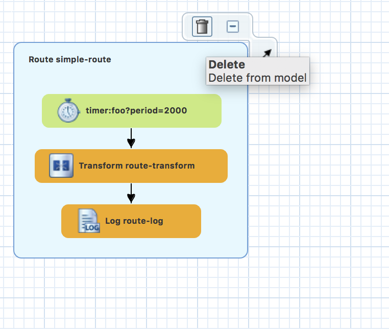

## The EIPs

EIP seats the center stage of Fuse, and plays the essential part in system integration. There is a miss conception of EIP being just for messaging, but even in today's API centric environment, you still need to solve integrate problems. In today’s cloud based applications RESTful services seems to be the most used pattern for integration.  


### Create a New Fuse Project on OpenShift

Start with built-in SpringBoot on OpenShift template. Right click in the Project Explorer pane and select New > Fuse Integration Project.


On the Choose a Project name page, enter a project name in the Project Name field. Click Next to continue and accept the defaults for all the other fields.  


On the Select a Target Runtime page, select Next to accept all the defaults.
Select the latest version available for Camel.  


The Advanced Project Setup page is where you select the pre-defined SpringBoot on OpenShift template.
Select Use a Predefined Template, Expand Fuse on OpenShift.  Select SpringBoot on Openshift.


The Project Type will be automatically set to Spring DSL.  


Click Finish.

### Update project name

In the POM file change the project name: 

```
<artifactId>eip</artifactId> 
```

Copy sample in the repository file to project

-- Your Project
  
  - src/
  
  - configuration

  - target
  
  - **sample** 

### Clean up working canvas

As always, we want to satrt with a blank canvas. On the lefthand-side panel *Project Explorer*, under *Camel Context*, double click on the working Camel *camel-context.xml* this will open up your camel canvas. Hover over the mouse cursor on the existing route, click on the trash can icon as it appears.




In the **Design** view, First drag a route onto the Blank Canvas. 
Then do the following. 

- ***File*** under Component

*Advance Tab*
	-- Path -> Directory Name : data/input
	-- Filter -> Move : backup/${date:now:yyyyMMddHHmmssSSS}-${file:name}

```

<from id="_from1" uri="file:data/input?move=backup/${date:now:yyyyMMddHHmmssSSS}-${file:name}"/>

```	

- ***Split*** under Routing
	
*Details Tab*
	-- Language : xpath
	-- Expression : /residence/resident
	
```

<split id="_split1">
	<xpath>/residence/resident</xpath>
</split>
```	
	
- ***Data Transformation*** under Transformation

1. *New Transformation* enter configs below and click next.
   Transformation ID: newcomernotice
   Source Type : XML 
   Target Type : JSON
2. *Source Type (XML)* enter configs below and click next.
	XML Type Definition : XML Instance Document
	Source File : data/sample/singlecomer.xml
3. *Source Type (JSON)* enter configs below and click Finish.
	JSON Type Definition : XML Instance Document
	Source File : data/sample/notice.json
4. Map between two data formats. 
	- Resident phone to Notice phone
	- Resident name to Notice name
	- Resident vehicles to Notice vehicles
	- Resident household to Notice occupience
	
```

<endpoint id="newcomernotice" uri="dozer:newcomernotice?sourceModel=generated_1517054844604.Resident&amp;targetModel=notice.Notice&amp;marshalId=transform-json&amp;unmarshalId=generated_1517054844604&amp;mappingFile=transformation.xml"/>
<dataFormats>
  <jaxb contextPath="generated_1517054844604" id="generated_1517054844604"/>
  <json id="transform-json" library="Jackson"/>
</dataFormats>
        
<to id="_to1" uri="ref:newcomernotice"/>
        
```	
	
- ***SetHeader*** under Transformation

*Details Tab*
	-- Language : simple
	-- Expression : ${date:now:yyyyMMddHHmmssSSS}-notice.json
	-- Header Name : CamelFileName
	
```

<setHeader headerName="CamelFileName" id="_setHeader1">
  <simple>${date:now:yyyyMMddHHmmssSSS}-notice.json</simple>
</setHeader>
                
```	
		
- ***Choice*** under Routing
	
```
<choice id="_choice1" />

```	
	
- ***When*** under Routing (Place under Choice)

*Details Tab*
	-- Language : jsonpath
	-- Expression : $[?(@.vechicle > 0)]
	-- Header Name : CamelFileName
	
```

<when id="_when1">
  <jsonpath>$[?(@.vechicle &gt; 0)]</jsonpath>
</when>

```	
		
- ***File*** under Component (Place under When)

*Advance Tab*
	-- Path -> Directory Name : data/output/garage
	-- Filter -> Move : backup/${date:now:yyyyMMddHHmmssSSS}-${file:name}
	
```

<to id="_to2" uri="file:data/output/garage"/>

```	
	
- ***Otherwise*** under Routing (Place under Choice)
	
```

<otherwise id="_otherwise1" />

```	
	
- ***File*** under Component(Otherwise under When)

*Advance Tab*
	-- Path -> Directory Name : data/output/condo
	-- Filter -> Move : backup/${date:now:yyyyMMddHHmmssSSS}-${file:name}
	
```

 <to id="_to2" uri="file:data/output/condo"/>
 
 
```	
	


### Running Test 

In your terminal go to your project directory (or Run as -> Maven Builds in JBDS), run maven install to generate the files.  

```
mvn spring-boot:run
```

To test, under your project folder, place the input file *newcomer.xml* under data/input folder


-- Your Project
  
  - src/
  
  - configuration

  - target
  
  - sample  
  
  - ***data/input*** <-- newcomer.xml
  
  

### Deploy to OpenShift

In your terminal go to your project directory (or Run as -> Maven Builds in JBDS), run maven install to generate the files.  

```
mvn clean fabric8:deploy
```


with Following JRE VM arguments:

```
-Dkubernetes.master=YOUR_OSE_HOST
-Dkubernetes.namespace=YOUR_PROJECT_NAME
-Dkubernetes.auth.basic.username=USER_NAME
-Dkubernetes.auth.basic.password=PASSWORD
-Dfabric8.mode=openshift
-Dkubernetes.trust.certificates=true
-Dfabric8.build.strategy=s2i
-Dkubernetes.auth.tryServiceAccount=false
-Dfabric8.generator.from=registry.access.redhat.com/jboss-fuse-6/fis-java-openshift
-Dfabric8.generator.fromMode=docker
-Dkubernetes.auth.tryKubeConfig=false
```

On openshift create route for your service
And Test the application by

1. Use **oc get** pod to retreive the pod that is running the application
2. Locate the folder wher you wish to upload and use **oc rsync** to upload the entire directory onto the environment.
3. SSH into the pod **oc rsh** and see the result of the output by going into /deployments/data/output
4. 

```
oc login YOUR_OSE_HOST

oc get pod

oc rsync LOCAL_FILE_FOLDER YOUR_POD_NAME:/deployments/data/input/

oc rsh YOUR_POD_NAME
```