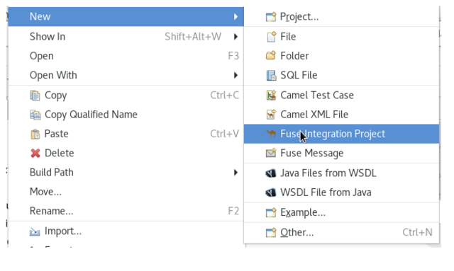
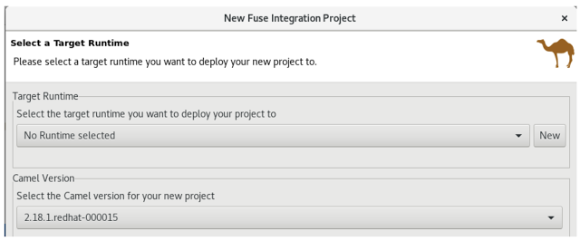
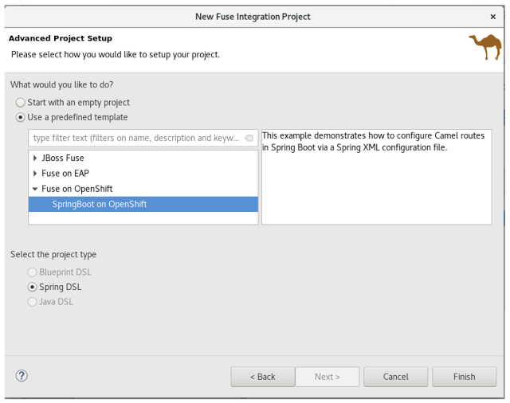
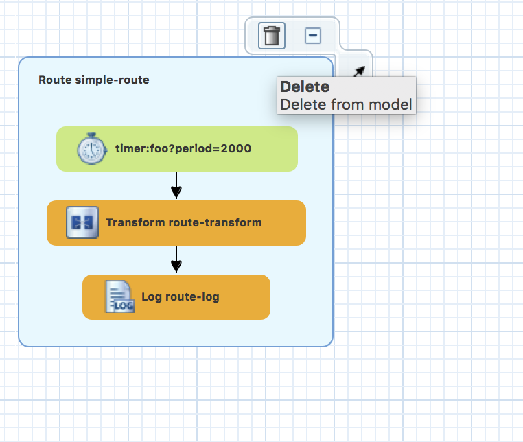

## SOAP to REST

One of the common question when enagage in an API conversation how to take the traditional SOAP base webservices to REST HTTP base APIs. IMHO, the best practice is alway take into client oriented deisgn into account, separate client facing logic with internal system moudularity. This often lead to refactorying the original service. Under some circumstance a quick fix is needed by adding another layer on top of the original SOAP-Based webservice. In this tech quickie, a quick and dirty hack to does exactly that. 


### Create a New Fuse Project on OpenShift

Start with built-in SpringBoot on OpenShift template. Right click in the Project Explorer pane and select New > Fuse Integration Project.



On the Choose a Project name page, enter a project name in the Project Name field. Click Next to continue and accept the defaults for all the other fields.  


On the Select a Target Runtime page, select Next to accept all the defaults.
Select the latest version available for Camel.  



The Advanced Project Setup page is where you select the pre-defined SpringBoot on OpenShift template.
Select Use a Predefined Template, Expand Fuse on OpenShift.  Select SpringBoot on Openshift.



The Project Type will be automatically set to Spring DSL.  


Click Finish.


### Clean up working canvas

As always, we want to satrt with a blank canvas. On the lefthand-side panel *Project Explorer*, under *Camel Context*, double click on the working Camel *camel-context.xml* this will open up your camel canvas. Hover over the mouse cursor on the existing route, click on the trash can icon as it appears.




### Generate working source from WSDL

We are about to connect to an existing SOAP-BASE webservice. This WSDL of webservice is available under 

```
http://soap-mock.apps.b3dd.openshift.opentlc.com/ws/greeting?wsdl
```

In this case, WSDL are pre-defined, we can simply use it to generate what we need to call the class. Include the cxf-codegen-plugin in the POM file. This will build the associated JAVA objects

```
<plugin>
	<groupId>org.apache.cxf</groupId>
	<artifactId>cxf-codegen-plugin</artifactId>
	<version>3.1.3</version>
	<executions>
		<execution>
			<id>generate-sources</id>
			<phase>generate-sources</phase>
			<goals>
				<goal>wsdl2java</goal>
			</goals>
			<configuration>
				<sourceRoot>${basedir}/src/main/java</sourceRoot>
					<wsdlOptions>
						<wsdlOption>
							<wsdl>http://soap-mock.apps.b3dd.openshift.opentlc.com/ws/greeting?wsdl</wsdl>
						</wsdlOption>
					</wsdlOptions>
			</configuration>
		</execution>
	</executions>
 </plugin>
```

In your terminal go to your project directory (or Run as -> Maven Builds in JBDS), run maven install to generate the files.  

```
mvn clean install
```


You will find all the JAVA object generated under *PROJECT_FOLDER/src/main/java* 
If you plan to run this locally, remember to mark this plugin in the POM file. So it does not try to generate object everytime when you tries to run it. 

Since we are in the POM file, let's add all the needed libraries into it. 

### Setup project dependencies
Add dependencies to your POM file

```
    <dependency>
      <groupId>org.apache.camel</groupId>
      <artifactId>camel-netty4-http-starter</artifactId>
    </dependency>
    <dependency>
	  <groupId>org.apache.camel</groupId>
	  <artifactId>camel-jackson-starter</artifactId>
	</dependency>
	<dependency>
	  <groupId>org.apache.camel</groupId>
	  <artifactId>camel-cxf-starter</artifactId>
	</dependency>
	<dependency>
       <groupId>org.apache.camel</groupId>
       <artifactId>camel-jaxb-starter</artifactId>
    </dependency>
    <dependency>
       <groupId>org.apache.camel</groupId>
       <artifactId>camel-soap-starter</artifactId>
    </dependency>  
```

Change the project name in the POM file: 

```
<artifactId>soaptorest</artifactId> 
```

Now it's time to code! In your Camel Canvas, we will be working with CXF component, so remember to add CXF schema on the top of your Camel Canvas in **source** view.

```
<beans xmlns="http://www.springframework.org/schema/beans"
    xmlns:camel="http://camel.apache.org/schema/spring"
    xmlns:cxf="http://camel.apache.org/schema/cxf"
    xmlns:xsi="http://www.w3.org/2001/XMLSchema-instance" xsi:schemaLocation="             http://www.springframework.org/schema/beans http://www.springframework.org/schema/beans/spring-beans.xsd             http://camel.apache.org/schema/spring http://camel.apache.org/schema/spring/camel-spring.xsd      http://camel.apache.org/schema/cxf http://camel.apache.org/schema/cxf/camel-cxf-spring.xsd">
```

### Setup SOAP WS client connector

Configure the SOAP-WS endpoint before the actual **<camelcontext>**

```
<cxf:cxfEndpoint
        address="http://soap-mock.apps.b3dd.openshift.opentlc.com/ws/greeting"
        endpointName="GreetingServicePort" id="greet"
        serviceClass="org.mycompany.GreetingServicePortType"
        serviceName="tns:GreetingService"
        wsdlURL="http://soap-mock.apps.b3dd.openshift.opentlc.com/ws/greeting?wsdl" xmlns:tns="http://mycompany.org/"/>
```  

Apart from the You can most of the mapping from the WSDL itself. NOTE the serviceClass is the SEI (service endpoint interface) not the client implmentation class. 


```
<wsdl:definitions xmlns:xsd="http://www.w3.org/2001/XMLSchema" xmlns:wsdl="http://schemas.xmlsoap.org/wsdl/" xmlns:tns="http://mycompany.org/" xmlns:soap="http://schemas.xmlsoap.org/wsdl/soap/" xmlns:ns1="http://schemas.xmlsoap.org/soap/http" name="GreetingService" targetNamespace="http://mycompany.org/">
.....
<wsdl:service name="GreetingService">
	<wsdl:port binding="tns:GreetingServiceSoapBinding" name="GreetingServicePort">
		<soap:address location="http://soap-mock.apps.b3dd.openshift.opentlc.com/ws/greeting"/>
	</wsdl:port>
</wsdl:service>
.....
```

### Create REST Endpoint
Under **<camelcontext>** add the REST DSL that takes in/ output JSON Dataformat. 
Here we are going to setup a POST that takes in a name (arg0) and output greeting as the return value. 

```
<restConfiguration component="netty4-http" host="0.0.0.0" port="10000"/>
<rest path="/say">
	<post bindingMode="json" consumes="application/json" type="org.mycompany.Hello" uri="hello">
      	<to uri="direct:processrest"/>
   </post>
</rest>
```

### REST to SOAP

In the **Design** view, First drag a route onto the Blank Canvas. 
Then do the following. 

- ***Direct*** under Component

*Advanced Tab* 
	-- Path -> Name: processrest

	
	<from id="_from1" uri="direct:processrest"/>
	
	
- ***Marshal*** under Transformation

*Detail Tab* 
	-- Data Formate Type : soapjaxb
	-- Context Path : org.mycompany
	
	
	
	
	 <marshal id="_marshal1">
   		<soapjaxb contextPath="org.mycompany"/>
         </marshal>
    
	

- ***CXF*** under Component

*Advanced Tab*
	-- Path -> Addredd: greet
	-- Path -> Bean Id: bean
	-- Common -> Data Format: MESSAGE
	
	
	
	<to id="_to3" uri="cxf:bean:greet?dataFormat=MESSAGE"/>
	
	
	
- ***Unmarshal*** under Transformation

*Detail Tab*
	-- Data Formate Type : soapjaxb
	-- Context Path : org.mycompany

	
	
	<unmarshal id="_marshal2">
	  <soapjaxb contextPath="org.mycompany"/>
        </unmarshal>
   
	
	
- ***Marshal*** under Transformation

*Detail Tab*
	-- Data Formate Type : json
	-- Library : Jackson
	
	
	<marshal id="_marshal3">
       	  <json library="Jackson"/>
        </marshal><from id="_from1" uri="direct:processrest"/>
	

### Running Test 

In your terminal go to your project directory (or Run as -> Maven Builds in JBDS), run maven install to generate the files.  

```
mvn spring-boot:run
```

use following command to test:

```
curl -X POST \
  http://localhost:10000/say/hello \
  -H 'cache-control: no-cache' \
  -H 'content-type: application/json' \
  -d '{"arg0":"Christina"}'
```

### Deploy to OpenShift

In your terminal go to your project directory (or Run as -> Maven Builds in JBDS), run maven install to generate the files.  

```
mvn clean fabric8:deploy
```


with Following JRE VM arguments:

```
-Dkubernetes.master=YOUR_OSE_HOST
-Dkubernetes.namespace=YOUR_PROJECT_NAME
-Dkubernetes.auth.basic.username=USER_NAME
-Dkubernetes.auth.basic.password=PASSWORD
-Dfabric8.mode=openshift
-Dkubernetes.trust.certificates=true
-Dfabric8.build.strategy=s2i
-Dkubernetes.auth.tryServiceAccount=false
-Dfabric8.generator.from=registry.access.redhat.com/jboss-fuse-6/fis-java-openshift
-Dfabric8.generator.fromMode=docker
-Dkubernetes.auth.tryKubeConfig=false
```

On openshift create route for your service

```	
oc expose svc/soaptorest
```

And Test the application by the following command

```
curl -X POST \
  http://YOUR_ROUTE/say/hello \
  -H 'cache-control: no-cache' \
  -H 'content-type: application/json' \
  -d '{"arg0":"Christina"}'
```
